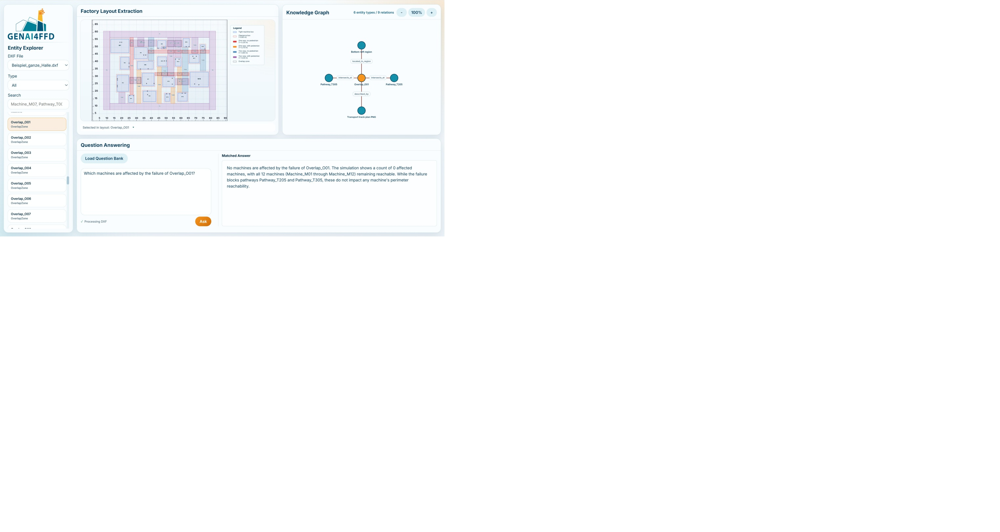

# CAD Parsing and Knowledge Graph Construction Demo

Static web demonstration of paper `Automated CAD Parsing and Knowledge Graph Construction for LLM-based Spatial Query Answering in Factory Pathway Planning` for exploring a factory pathway layout, the text-based knowledge graph, and question-answering results.



## Included Data

- GeoJSON data extracted from a DXF file
- Knowledge-graph nodes and triples
- Question bank and QA answers

## Run Locally

Serve the directory through a static HTTP server:

```bash
python -m http.server 8000
```

Then open `http://localhost:8000`.

Opening `index.html` directly with a `file://` URL will not work because browsers
block JavaScript from loading the local JSON files.


## Acknowledgements
This research is funded by the German Federal Ministry of Research, Technology and Space (BMFTR) under the project GenAI4FFD (Number: 01MK25003E). We sincerely appreciate the support provided by the German Aerospace Center (DLR), the Fraunhofer IFF, and our industrial partners for their cooperation.